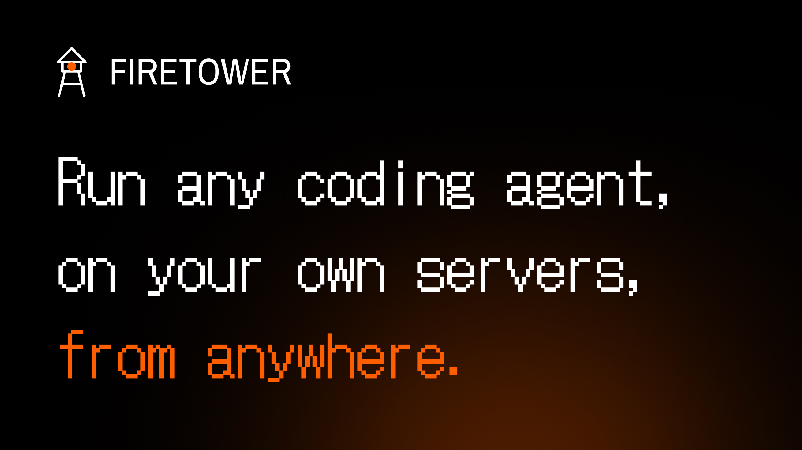

<div align="center">

[](https://usefiretower.com)

[](https://github.com/firetower-cloud/firetower/blob/main/LICENSE) [](https://github.com/firetower-cloud/firetower/releases) [](https://github.com/firetower-cloud/firetower/pkgs/container/firetower) [](https://github.com/firetower-cloud/firetower/stargazers)

**Firetower is a control plane for coding agents.**

Give it a server you can SSH into and a repository, describe some work, and it picks a host,
cuts a branch, makes a worktree, starts tmux, launches the agent, and keeps it running.
Attach from a browser or a phone, answer questions, review the diff, ship the branch, destroy the workspace.

[](https://usefiretower.com/docs)

[Website](https://usefiretower.com) · [Getting started](https://usefiretower.com/docs/getting-started) · [How it works](https://usefiretower.com/docs/self-hosting) · [Issues](https://github.com/firetower-cloud/firetower/issues)

### 🌟 Star the repository to support us 🌟

</div>

---

## What it is

Agents block. You are the bottleneck. Firetower's job is to route their blocking to you — wherever you are — and get you back out fast.

That's why the dashboard is an inbox rather than a fleet monitor, and why a session that asked a question, finished a turn, or hit an expired credential all land in the same place. They mean the same thing: *it stopped being useful without you.*

- **Any agent, any machine.** This laptop, a container here, or a server you SSH into. Firetower installs nothing you didn't put there.
- **Sessions survive you.** The worker records what happened before reporting it, so closing your laptop costs nothing.
- **The terminal in your browser.** Attach, answer, review the diff, push the branch, open the pull request.
- **Credentials stay yours.** Every token is sealed with envelope encryption under a root key that never enters the database.
- **Self-hosted, no account.** The worker never dials out.

## How it fits together

```
                                                             +-[x]- GCP VM . 34.79.12.180 --------------+
                                                             |  worker . tmux . git                     |
+-[x]- FIRETOWER --------------------------+       +-------->|  * Claude Code  westlabs/ledger   2h48m  |
|  inbox        * 2 waiting on you         |       |         |  o Codex        westlabs/api      3h34m  |
|                                          |       |         +------------------------------------------+
|  runs on your laptop, or on a            |--ssh--+
|  server you already own                  |       |         +-[x]- Hetzner VM . 5.161.44.9 ------------+
+------------------------------------------+       |         |  worker . tmux . git                     |
                                                   +-------->|  o Claude Code  westlabs/web      2h01m  |
                                                             +------------------------------------------+
```

`*` a session that has stopped and needs you · `o` one still working, nothing to do · `ssh` how the app reaches a machine you own

The control plane owns intent: hosts, repositories, credentials, and what should run where. Workers own reality: they write the event log first and report afterwards, so a reconnecting control plane just asks for everything since the last thing it saw.

**The worker never opens a port.** It reads frames from stdin and writes them to stdout, so who dials is a transport detail — a child process, `docker exec -i`, or `ssh host firetower worker --stdio`. The daemon can't tell the difference. `localhost` is a real host, not a special case: it appears in the fleet, runs sessions, and can be drained.

<div align="center">

[](https://usefiretower.com/docs/self-hosting)

</div>

## Running it

Docker, and nothing else. Everything is in one image: the control plane, the interface compiled into the binary, and what a session needs to run.

```sh
curl -O https://raw.githubusercontent.com/firetower-cloud/firetower/main/deploy/firetower.yml
curl -O https://raw.githubusercontent.com/firetower-cloud/firetower/main/deploy/Caddyfile
curl -o .env https://raw.githubusercontent.com/firetower-cloud/firetower/main/deploy/.env.example

docker compose -f firetower.yml up -d
```

The first start makes an administrator and prints its password once — `docker compose -f firetower.yml logs firetower`.

Everything else — putting it on a domain, adding a server, connecting repositories, secrets, upgrades — is in the documentation.

<div align="center">

[](https://usefiretower.com/docs/getting-started)

</div>

## Documentation

| | |
| --- | --- |
| [Getting started](https://usefiretower.com/docs/getting-started) | The short path from nothing to a running session |
| [How it works](https://usefiretower.com/docs/self-hosting) | Control plane, workers, and the protocol between them |
| [Install the app](https://usefiretower.com/docs/self-hosting/app/install) | The control plane, with Docker |
| [Add a machine](https://usefiretower.com/docs/self-hosting/machines/install) | Run sessions on a server over SSH |
| [Put it on a domain](https://usefiretower.com/docs/self-hosting/domain) | HTTPS, certificates, and what goes wrong |
| [Daily operations](https://usefiretower.com/docs/self-hosting/operations) | Draining, backups, and version drift |
| [Upgrading](https://usefiretower.com/docs/self-hosting/app/upgrade) | The app and [the worker](https://usefiretower.com/docs/self-hosting/machines/upgrade) |
| [Connect repositories](https://usefiretower.com/docs/repositories) | Git URLs, paths, and authorizing GitHub |
| [Secrets](https://usefiretower.com/docs/secrets) | How credentials are sealed, and where the root key lives |


## Contributing

Building Firetower rather than running it is a different set of tools and a different set of commands. They live in [CONTRIBUTING.md](CONTRIBUTING.md).

## Licence

AGPL-3.0-only. Copyright © Westlabs LLC.

If you run a modified Firetower as a network service, you have to publish your changes.
